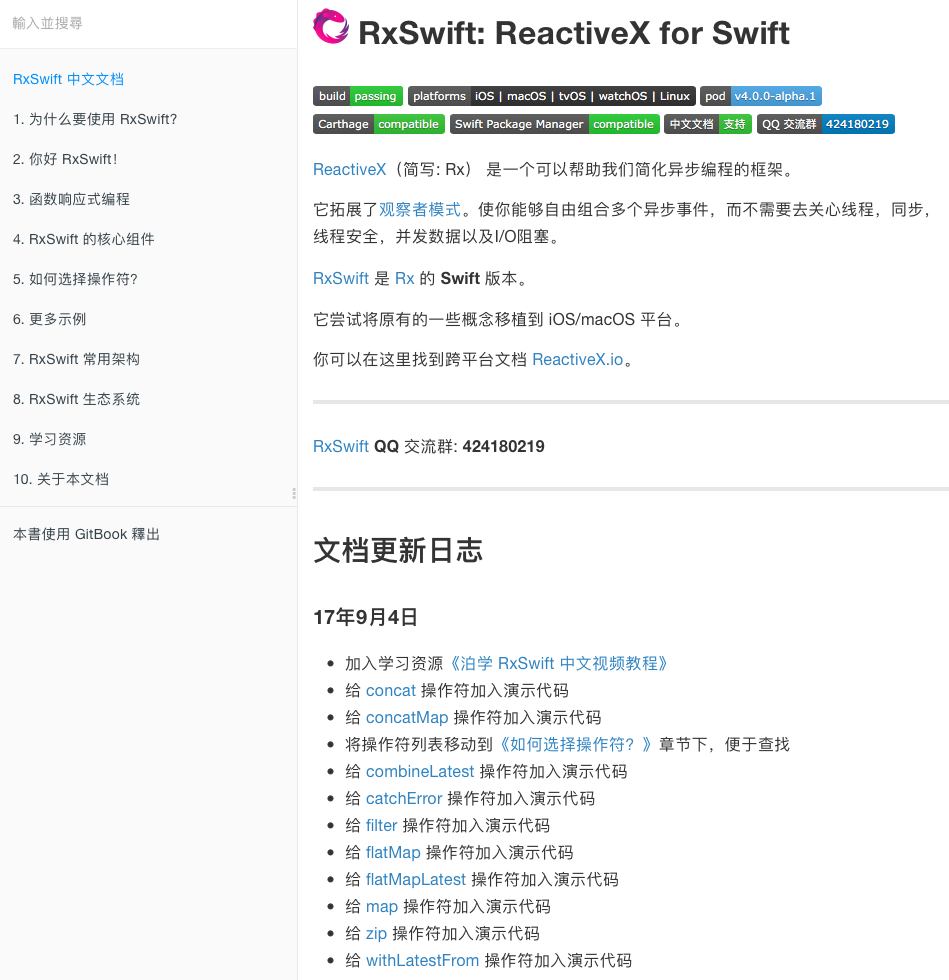
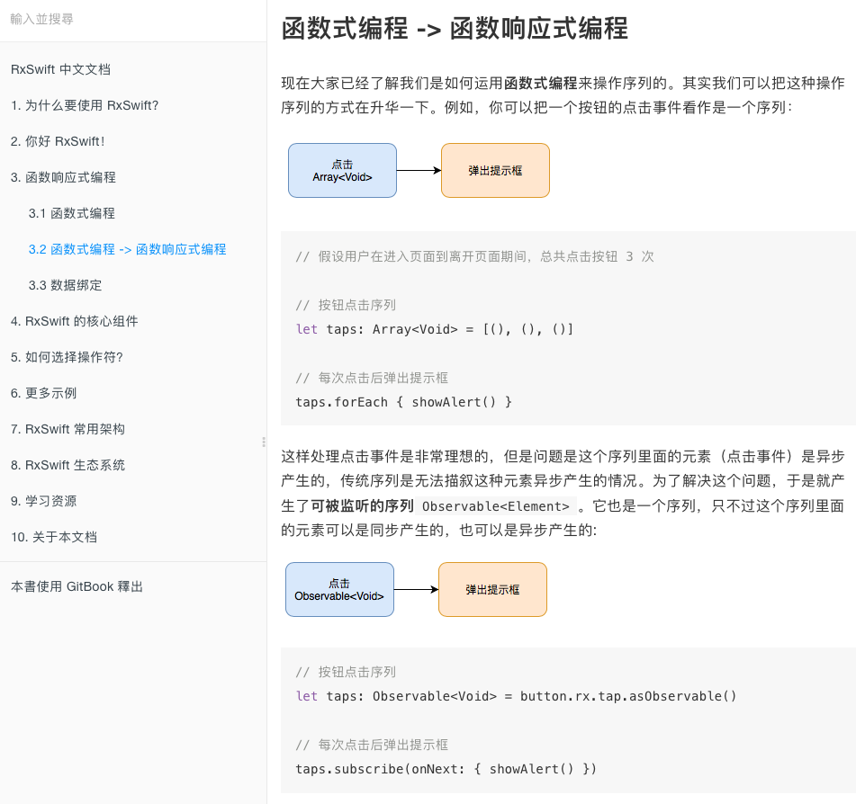
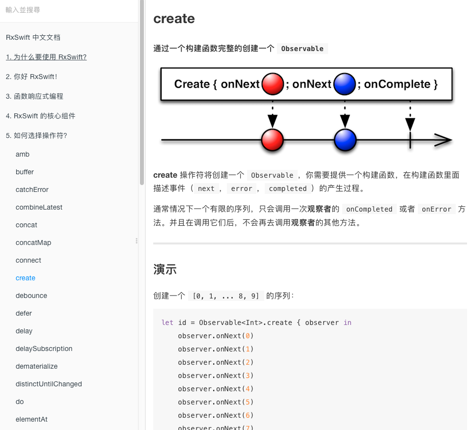
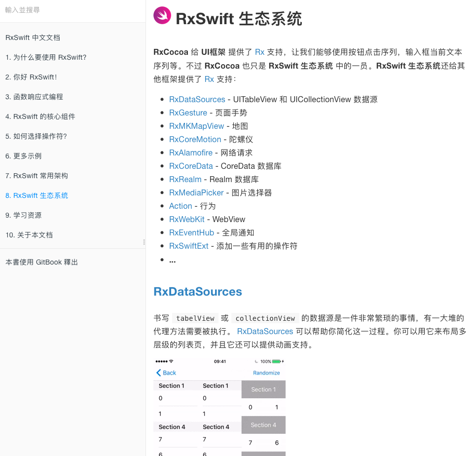

# RxSwift 中文文档（非官方）

地址： https://beeth0ven.github.io/RxSwift-Chinese-Documentation/

**如果以上地址被墙，可临时访问：https://rxswift.picroup.com/**

## 简介

这是一份 [RxSwift] 中文文档。如今响应式编程变得越来越流行，我们已经无法阻挡这股热潮。这份文档整合了 [RxSwift] 文档，[RxJS] 文档，[ReactiveX] 文档以及笔者的一些个人观点。目的是为了让大家能够快速上手响应式编程。虽然本文档主要是介绍 [RxSwift]，不过使用其他响应式框架的开发者也可以从中获益，例如：[ReactiveCocoa]，[RxJava]，[RxJS] 等。因为这些框架都有一些共性，例如：响应式的思维方式，操作符的功能及用法等。而这些内容文档里面都有介绍。

由于这是笔者第一次发布文档，如果文档存在问题，还请谅解。你可通过 [10. 关于本文档] 页面提供的方式，将问题反馈给笔者。同时也非常欢迎大家给我发合并请求。

## 目录

* [RxSwift 中文文档]
* [1. 为什么要使用 RxSwift?]
* [2. 你好 RxSwift！]
* [3. 函数响应式编程]
* [4. RxSwift 的核心组件]
* [5. 如何选择操作符？]
* [6. 更多示例]
* [7. RxSwift 常用架构]
* [8. RxSwift 生态系统]
* [9. 学习资源]
* [10. 关于本文档]

## 预览

---

---

---

[RxSwift 中文文档]:https://beeth0ven.github.io/RxSwift-Chinese-Documentation/
[1. 为什么要使用 RxSwift?]:https://beeth0ven.github.io/RxSwift-Chinese-Documentation/content/why_rxswift.html
[2. 你好 RxSwift！]:https://beeth0ven.github.io/RxSwift-Chinese-Documentation/content/first_app.html
[3. 函数响应式编程]:https://beeth0ven.github.io/RxSwift-Chinese-Documentation/content/think_reactive.html
[4. RxSwift 的核心组件]:https://beeth0ven.github.io/RxSwift-Chinese-Documentation/content/rxswift_core.html
[5. 如何选择操作符？]:https://beeth0ven.github.io/RxSwift-Chinese-Documentation/content/decision_tree.html
[6. 更多示例]:https://beeth0ven.github.io/RxSwift-Chinese-Documentation/content/more_demo.html
[7. RxSwift 常用架构]:https://beeth0ven.github.io/RxSwift-Chinese-Documentation/content/architecture.html
[8. RxSwift 生态系统]:https://beeth0ven.github.io/RxSwift-Chinese-Documentation/content/rxswift_ecosystem.html
[9. 学习资源]:https://beeth0ven.github.io/RxSwift-Chinese-Documentation/content/resource.html
[10. 关于本文档]:https://beeth0ven.github.io/RxSwift-Chinese-Documentation/content/about.html

[RxSwift]:https://github.com/ReactiveX/RxSwift
[ReactiveX]:http://reactivex.io/
[RxJava]:https://github.com/ReactiveX/RxJava
[RxJS]:https://github.com/Reactive-Extensions/RxJS
[ReactiveCocoa]:https://github.com/ReactiveCocoa/ReactiveCocoa
